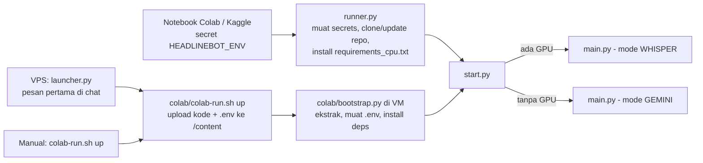
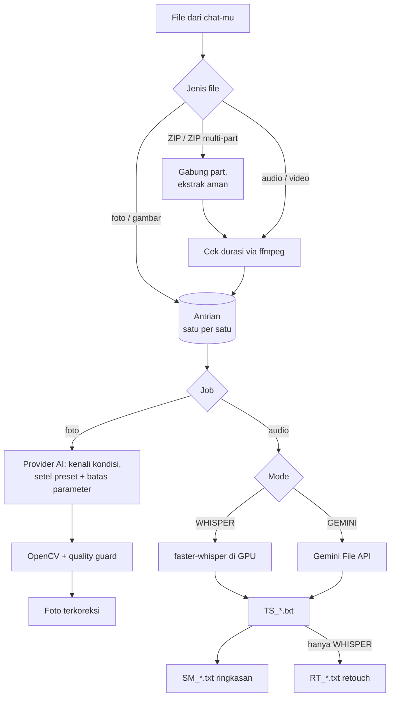
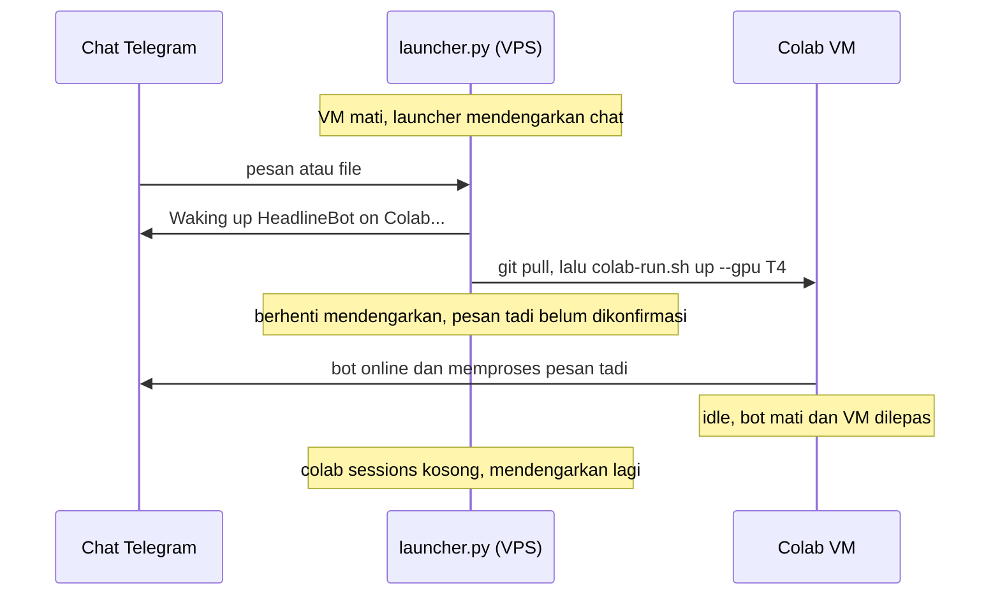

# 📰 HeadlineBot

**Transkrip, ringkasan jurnalistik, dan koreksi warna foto — langsung dari Telegram.**

Kirim rekaman wawancara, video, atau foto ke bot Telegram-mu. HeadlineBot berjalan di VM gratis Google Colab (atau Kaggle), mentranskrip dengan Whisper di GPU, menulis ringkasan berformat berita, dan mengoreksi warna foto lapangan. Bot hanya menyala saat dibutuhkan, lalu mematikan dirinya sendiri untuk menghemat kuota.

---

## ✨ Fitur

| Fitur | Keterangan |
| :--- | :--- |
| 🎙️ **Transkripsi** | Audio, video, dan voice note apa pun yang bisa dibaca ffmpeg. GPU: faster-whisper `large-v2`, tanpa batas durasi. Tanpa GPU: Gemini, maks 20 menit per file. Hasil: teks tanpa timestamp, dipisah per paragraf. |
| 📝 **Ringkasan jurnalistik** | Bahasa Indonesia: Fakta Berita, Lead, Body per topik, Narasumber + kutipan, Data Pendukung, Perlu Klarifikasi. Tidak mengarang: bagian tanpa data dikosongkan. |
| 🔧 **Retouch transkrip** | Transkrip Whisper dirapikan (typo, tanda baca, paragraf) tanpa mengubah isi. |
| 🎨 **Koreksi warna foto** | AI mengenali kondisi foto (backlight, low light, portrait, green cast, …), menyetel preset kondisi itu dengan batas parameter terkunci, lalu OpenCV menerapkannya. |
| 📁 **ZIP & ZIP multi-part** | `rekaman.zip` atau `rekaman.zip.001`, `.002`, … digabung otomatis, diekstrak dengan aman, lalu setiap file masuk antrian. |
| 🧠 **Provider AI pilihan** | Ringkasan, retouch, dan foto memakai API kompatibel OpenAI (default: OpenCode Go) atau Gemini. Model dicoba berurutan; jika satu gagal, lanjut ke berikutnya. |
| 🔌 **Hemat kuota** | Idle monitor mematikan runtime saat tidak dipakai. Di VPS, launcher menyalakan Colab lagi saat ada pesan baru. |

---

## 💬 Pakai di Telegram

Bot hanya melayani **satu chat** (`TELEGRAM_CHAT_ID`); chat lain diabaikan, dan tombol hanya bisa ditekan dari chat itu.

### Kirim → Terima

| Kirim | Terima |
| :--- | :--- |
| Audio / video / voice note | `✅ Queued` + tombol ❌ → `▶️ Processing` → `✅ Done!` (durasi, waktu proses, bahasa) + file **`TS_(<durasi>)_<nama>.txt`**, lalu **`SM_…txt`** (ringkasan) dan, di mode GPU, **`RT_…txt`** (retouch) |
| Foto / gambar (`.jpg .jpeg .png .webp .bmp .tiff`) | `🎨 Analyzing…` → foto terkoreksi dengan diagnosis kondisinya |
| `.zip` / `.zip.001`, `.zip.002`, … | Part digabung 30 detik setelah part terakhir, diekstrak, tiap file diantrikan |

File diproses **satu per satu** sesuai antrian. File yang dikirim saat AI masih dimuat tetap diantrikan (tanda ⏳) dan diproses begitu siap.

### Perintah & tombol

| Perintah / tombol | Fungsi |
| :--- | :--- |
| `/start`, `/status` | Status: hardware, engine, job yang sedang jalan, uptime, antrian. Tombol **📄 View Orders** (batalkan job di antrian), **🔄** (refresh), **🔌** (matikan) |
| `/queue` | Daftar job: yang sedang diproses dan yang menunggu |
| `/extend` | Tambah 5 menit sebelum idle shutdown |
| ❌ (di pesan `Queued`) | Batalkan job yang **belum** diproses |
| 🔌 | Minta konfirmasi dulu (**✅ Yes, shut down** / **« Cancel**), lalu matikan bot dan runtime |
| ⏳ +5m (di peringatan idle) | Tunda shutdown 5 menit (maks sekali per 5 menit) |

### Batasan

- Maks **20 MB** per file (batas download bot Telegram). File lebih besar: kirim sebagai ZIP multi-part.
- Mode CPU (Gemini): maks **20 menit** audio per file.
- Tanpa provider AI yang siap (mis. API key kosong), transkrip tetap dikirim; ringkasan/retouch dilewati dan foto dikembalikan apa adanya dengan keterangan *AI color correction is off*.

---

## ⚙️ Cara Kerja

### Menyalakan bot

Ada tiga jalur. Semuanya berakhir di `start.py`, yang memilih mode dari ada/tidaknya GPU (`nvidia-smi`).



Di `main.py`, bot langsung online dan menerima file, sementara AI dimuat di latar belakang:

1. Pesan sambutan (hardware, engine, provider AI, status) + notifikasi *Wok is heating up* / *Preparing ingredients*.
2. **Mode WHISPER:** install `requirements.txt` bila belum ada, unduh model Whisper `large-v2`, muat di GPU (float16). Jika gagal, bot pindah ke Gemini (butuh `GEMINI_API_KEY`); jika itu juga gagal, bot mati.
3. Siapkan Gemini (jika ada key) dan provider AI → *Kitchen is now open!* → worker mulai memproses antrian.

### Perjalanan sebuah file



- Ringkasan dan retouch berjalan paralel; masing-masing dikirim begitu selesai. Jika gagal, bot mengirim *⚠️ AI Failed* — transkrip tetap sudah terkirim.
- Audio yang diunggah ke Gemini dihapus dari server Gemini setelah transkripsi.
- Koreksi foto: kondisi (mis. `BACKLIGHT`) dipilih dari `presets.json`; model menyetel preset itu, lalu batas parameter kondisi tersebut dipaksakan di kode (mis. backlight: shadows ≥ 30, highlights ≤ −30). Jika hasilnya rusak (terlalu terang atau datar), foto asli yang dikirim.
- ZIP ditolak jika berisi path berbahaya (`..`, path absolut), symlink, atau > 2 GB setelah diekstrak. File sistem (`__MACOSX/`, file berawalan titik) dilewati.

### Idle & bangun otomatis

Idle monitor memeriksa setiap menit. Saat antrian kosong dan tidak ada job:

| Waktu idle | Aksi |
| :--- | :--- |
| 1 menit | Peringatan + tombol ⏳ +5m |
| 5 menit | Peringatan terakhir |
| 10 menit (`beta`: 5) | Bot mati; di Colab runtime dilepas |

Di mode GEMINI (tanpa GPU) semua waktu ini 5x lebih lama. Di Kaggle, bot berhenti tapi sesi notebook harus dihentikan manual.

Dengan **launcher di VPS**, bot terasa selalu siap:



Telegram menyimpan pesan yang belum dibaca bot (maks 24 jam) dan hanya mengizinkan satu pembaca update per bot. Karena itu launcher diam selama VM hidup, dan pesan pembangun tidak hilang. Pesan dari chat lain dan tombol yang ditekan saat bot mati diabaikan. Jika T4 gagal dinyalakan, launcher mengirim pesan error, melepas VM yang setengah jadi, dan melewati pesan tersebut.

---

## 🔐 Secrets: Satu File `.env`

Semua secret ada di **satu file `.env`** (di-`.gitignore`, tidak pernah masuk repo). Salin `.env.example` → `.env`, lalu isi:

| Variable | Keterangan |
| :--- | :--- |
| `TELEGRAM_BOT_TOKEN` | Dari @BotFather (**wajib**) |
| `TELEGRAM_CHAT_ID` | ID chat yang dilayani bot (**wajib**) |
| `OPENAI_COMPAT_API_KEY` | API key provider AI (default: OpenCode Go) — ringkasan, retouch, koreksi foto |
| `GEMINI_API_KEY` | Transkripsi mode CPU, cadangan jika Whisper gagal, dan `LLM_PROVIDER = "gemini"` (opsional) |
| `HF_TOKEN` | Token Hugging Face untuk download model Whisper (opsional) |

- **VPS / colab CLI:** `.env` dipakai langsung dan di-upload ke VM (`/content/.env`).
- **Notebook Colab/Kaggle:** simpan base64 dari `.env` sebagai **satu** secret bernama `HEADLINEBOT_ENV`:

```powershell
# PowerShell (Windows) — hasil langsung masuk clipboard
[Convert]::ToBase64String([IO.File]::ReadAllBytes(".env")) | Set-Clipboard
```

```bash
base64 -w0 .env    # Linux
base64 -i .env     # macOS
```

Colab: tab 🔑 Secrets (aktifkan *Notebook access*). Kaggle: Add-ons → Secrets. Ulangi setiap `.env` berubah. `.env` yang disimpan di Windows (BOM, CRLF), baris komentar, `export`, dan nilai dalam tanda kutip dibaca dengan benar.

> Base64 hanya membungkus file jadi satu baris — **bukan enkripsi**. Yang melindungi secret-mu adalah penyimpanan Secrets Colab/Kaggle. Jangan tempel nilainya di kode atau chat.

---

## 🚀 Menjalankan

`VERSION = 'prod'` menjalankan branch `main`; `'beta'` menjalankan branch `beta`.

### Opsi A: Google Colab

1. Tambahkan secret `HEADLINEBOT_ENV`.
2. *Runtime > Change runtime type* → **T4 GPU**.
3. Jalankan sel ini:

```python
# 📰 HeadlineBot — Colab
import os, subprocess, urllib.request
from google.colab import userdata

VERSION = 'prod'  # ← 'prod' atau 'beta'
os.environ['HEADLINEBOT_VERSION'] = VERSION
os.environ['HEADLINEBOT_ENV'] = userdata.get('HEADLINEBOT_ENV')
_branch = 'beta' if VERSION == 'beta' else 'main'
urllib.request.urlretrieve(f'https://raw.githubusercontent.com/arinadi/HeadlineBot/{_branch}/runner.py', 'runner.py')

proc = subprocess.Popen(['python', 'runner.py'], stdout=subprocess.PIPE,
                        stderr=subprocess.STDOUT, bufsize=1, text=True)
for line in proc.stdout:
    print(line, end='', flush=True)
```

### Opsi B: Kaggle

1. Tambahkan secret `HEADLINEBOT_ENV` (Add-ons → Secrets).
2. *Settings > Accelerator* → **GPU T4 x2**; *Settings > Internet* → **on**.
3. Jalankan sel ini:

```python
# 📰 HeadlineBot — Kaggle
import os, subprocess, urllib.request
from kaggle_secrets import UserSecretsClient

VERSION = 'prod'  # ← 'prod' atau 'beta'
os.environ['HEADLINEBOT_VERSION'] = VERSION
os.environ['HEADLINEBOT_ENV'] = UserSecretsClient().get_secret('HEADLINEBOT_ENV')
_branch = 'beta' if VERSION == 'beta' else 'main'
urllib.request.urlretrieve(f'https://raw.githubusercontent.com/arinadi/HeadlineBot/{_branch}/runner.py', 'runner.py')

proc = subprocess.Popen(['python', 'runner.py'], stdout=subprocess.PIPE,
                        stderr=subprocess.STDOUT, bufsize=1, text=True)
for line in proc.stdout:
    print(line, end='', flush=True)
```

### Opsi C: VPS + colab CLI (bangun otomatis)

Server Linux kecil (Ubuntu, RAM 1 GB cukup) menjalankan `launcher.py` sebagai service. colab CLI hanya berjalan di Linux/macOS.

**1. Install (sekali)**

```bash
curl -LsSf https://astral.sh/uv/install.sh | sh     # uv menyediakan Python 3.12+ untuk colab CLI
uv tool install google-colab-cli
git clone https://github.com/arinadi/HeadlineBot.git ~/HeadlineBot
cd ~/HeadlineBot && git checkout main              # atau beta
cp .env.example .env && nano .env                  # isi secrets
colab sessions                                     # login sekali: buka URL, tempel kode
```

**2. Jalankan launcher**

```bash
sudo cp deploy/headlinebot-launcher@.service /etc/systemd/system/
sudo systemctl daemon-reload
sudo systemctl enable --now headlinebot-launcher@$USER
journalctl -u headlinebot-launcher@$USER -f        # log launcher
```

Service menjalankan `python3 launcher.py --version prod --gpu T4` dari `~/HeadlineBot`. Untuk beta, ganti `--version beta` di file service sebelum menyalinnya. Opsi lain: `--session NAMA` (nama sesi Colab), `--env PATH` (lokasi `.env`).

**Perintah manual** (tanpa launcher):

```bash
./colab/colab-run.sh up --gpu T4 --version beta    # nyalakan VM + bot (tanpa --gpu: CPU)
./colab/colab-run.sh up --cpu-deps                 # install requirements_cpu.txt saja
./colab/colab-run.sh logs --lines 100              # ekor bot.log di VM
./colab/colab-run.sh stop                          # lepas VM
```

`colab-run.sh up` mengemas checkout lokal (tanpa `.git`, `.env`, dan folder kerja bot), meng-upload kode, `.env`, dan `bootstrap.conf` ke `/content`, lalu menjalankan `colab/bootstrap.py` di VM.

### Lokal (development)

```bash
pip install -r requirements.txt
set -a; source .env; set +a     # muat secrets ke environment
python start.py
```

---

## 🛠️ Konfigurasi

Selain secrets, semua pengaturan adalah konstanta di [`headlinebot/config.py`](headlinebot/config.py). Ubah di file itu lalu push; notebook dan launcher selalu memakai kode terbaru dari branch-nya.

| Konstanta | Default | Keterangan |
| :--- | :--- | :--- |
| `ENABLE_AI_FEATURES` | `True` | Ringkasan, retouch, koreksi foto |
| `LLM_PROVIDER` | `"openai_compat"` | `"openai_compat"` atau `"gemini"` |
| `OPENAI_COMPAT_BASE_URL` | `"https://opencode.ai/zen/go/v1"` | Base URL API kompatibel OpenAI |
| `OPENAI_COMPAT_MODELS` | `["deepseek-v4.1-flash", "kimi-k3"]` | Model teks, dicoba berurutan |
| `OPENAI_COMPAT_VISION_MODELS` | `["deepseek-v4.1-flash", "glm-5.3-flash"]` | Model yang bisa membaca gambar |
| `GEMMA_MODEL` | `"models/gemma-4-26b-a4b-it"` | Model foto jika `LLM_PROVIDER = "gemini"` |
| `WHISPER_MODEL` | `"large-v2"` | Ukuran model Whisper |
| `WHISPER_PRECISION` | `"auto"` | `auto` (float16 di GPU), `float16`, `int8`, `float32` |
| `WHISPER_BEAM_SIZE`, `WHISPER_PATIENCE`, `WHISPER_TEMPERATURE`, `WHISPER_REPETITION_PENALTY`, `WHISPER_NO_REPEAT_NGRAM_SIZE` | `10`, `2.0`, `0.0`, `1.1`, `3` | Decoding Whisper |
| `VAD_FILTER` (+ `VAD_*`) | `False` | Buang jeda hening sebelum transkripsi |
| `BOT_FILESIZE_LIMIT` | `20` | Maks MB per file |
| `ENABLE_IDLE_MONITOR` | `True` | Matikan runtime saat idle |
| `IDLE_FIRST_ALERT_MINUTES`, `IDLE_FINAL_WARNING_MINUTES`, `IDLE_SHUTDOWN_MINUTES` | `1`, `5`, `10` (`beta`: shutdown `5`) | Jadwal idle; 5x di mode GEMINI |
| `JPEG_QUALITY` | `95` | Kualitas JPEG foto hasil koreksi |

### Provider AI

- **`openai_compat`** (default): API apa pun yang kompatibel dengan OpenAI Chat Completions. Teks memakai `OPENAI_COMPAT_MODELS`, foto memakai `OPENAI_COMPAT_VISION_MODELS`. Ke `opencode.ai`, setiap job mengirim header `x-opencode-session` sendiri (diwajibkan OpenCode Go) dan User-Agent `HeadlineBot`.
- **`gemini`**: Gemini/Gemma lewat `GEMINI_API_KEY`. Model dipilih otomatis dari model yang tersedia di akunmu, versi terbaru dulu: Gemma untuk ringkasan/retouch (Gemma lain sebagai cadangan), Flash untuk transkripsi mode CPU; foto memakai `GEMMA_MODEL`.

Jika provider tidak bisa dipakai (mis. key kosong), fitur AI mati dan admin diberi tahu lewat chat; transkripsi tetap jalan. Model mana yang bisa membaca gambar: lihat [models.dev](https://models.dev).

---

## ⚠️ Catatan

- **OpenCode Go** menyebut layanannya untuk trafik *coding agent* dan memantau trafik; pemakaian untuk bot ini bisa ditandai. Base URL lain yang kompatibel OpenAI bisa dipakai lewat `OPENAI_COMPAT_BASE_URL`.
- **Kuota Colab:** mode GPU memakai kuota GPU. Launcher meminta GPU sesuai `--gpu` (default T4); jika tidak tersedia, bot tidak dinyalakan dan launcher memberi tahu di chat.
- **Login colab CLI** di VPS disimpan di `~/.config/colab-cli`. Jika kedaluwarsa, jalankan `colab sessions` lagi.
- **Pesan > 24 jam** yang belum dibaca bot dihapus Telegram.

---

## 🧑‍💻 Development

### Struktur

```
HeadlineBot/
├── main.py                # Bot Telegram: handler, antrian & worker, muat model, shutdown
├── start.py               # Deteksi GPU (nvidia-smi) → mode WHISPER/GEMINI → main.py
├── runner.py              # Jalur notebook: secrets HEADLINEBOT_ENV, clone/update, deps; parser .env
├── launcher.py            # Jalur VPS: bangunkan Colab saat ada pesan (stdlib saja)
├── headlinebot/
│   ├── config.py          # Secrets dari environment + semua konstanta pengaturan
│   ├── bot_classes.py     # Job, JobManager (antrian), IdleMonitor, FilesHandler (file & ZIP)
│   ├── llm.py             # Provider AI: GeminiLLM, OpenAICompatLLM, build_llm
│   ├── model_manager.py   # Discovery & fallback model Gemini
│   ├── image_editor.py    # Analisis foto 2 tahap + pipeline OpenCV
│   └── utils.py           # Log, transkripsi Gemini, ringkasan, retouch, format
├── colab/
│   ├── colab-run.sh       # up / logs / stop lewat colab CLI
│   └── bootstrap.py       # Dijalankan di VM: ekstrak, muat .env, install, start
├── deploy/headlinebot-launcher@.service   # systemd untuk launcher
├── presets.json           # Preset & batas parameter koreksi warna per kondisi
├── tests/                 # pytest
├── requirements_cpu.txt   # Semua yang di-import main.py (mode GEMINI)
├── requirements.txt       # requirements_cpu.txt + faster-whisper (mode WHISPER)
├── requirements-dev.txt   # + ruff, pytest
└── agent.md               # Konteks untuk AI coding agent
```

### Lint & test

```bash
pip install -r requirements-dev.txt
ruff check .
python -m compileall -q .
pytest -q
```

GitHub Actions menjalankan ini di Python 3.13 (versi VM Colab) untuk setiap push/PR ke `main` dan `beta`. Job kedua, `colab-cli`, berjalan di Ubuntu tanpa login Google: `shellcheck colab/colab-run.sh`, mengecek bahwa colab CLI asli masih punya perintah/flag yang dipakai skrip dan launcher, lalu menjalankan `colab-run.sh` terhadap `colab` palsu dan `bootstrap.py` terhadap upload palsu. Tes skrip Linux dilewati di Windows.

### Alur branch

Perubahan masuk ke `beta`, dites dengan `VERSION = 'beta'` (atau `--version beta`), lalu `main` di-fast-forward ke `beta`.
